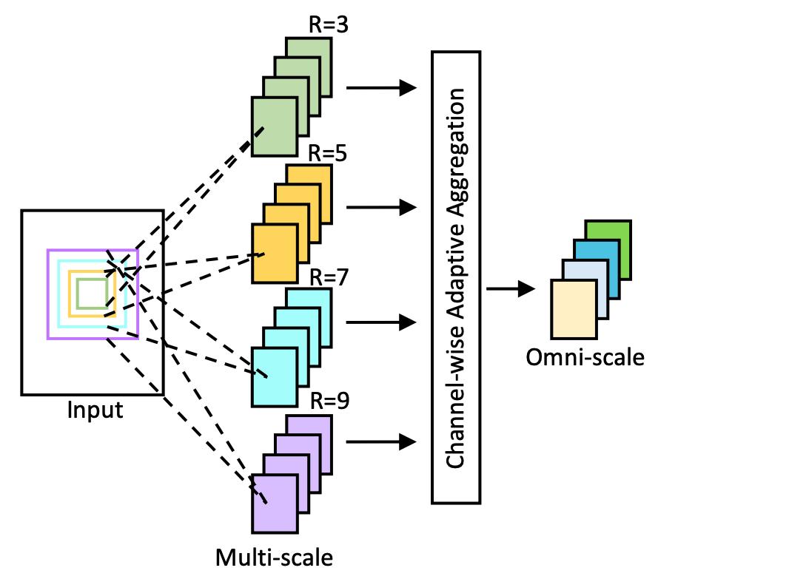
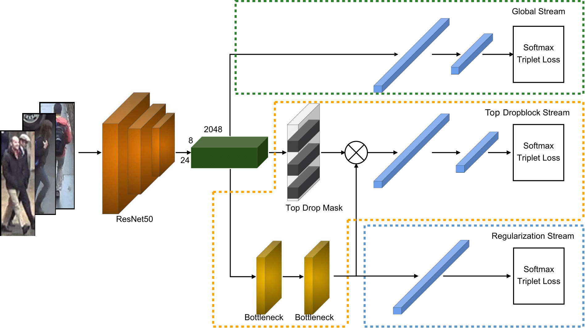
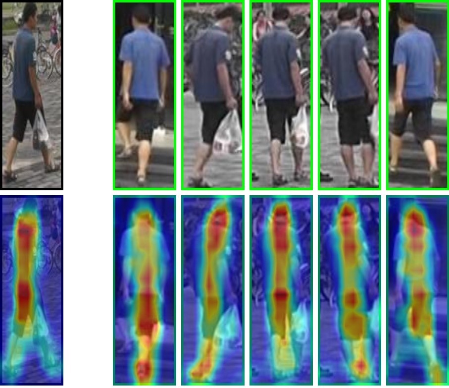

OSNet + Top-DB-Net
===========

This repository integrates **OSNet** (ICCV 2019) and **Top-DB-Net** (ICPR 2020).
The code is inspired by [KaiyangZhou/deep-person-reid](https://github.com/KaiyangZhou/deep-person-reid)

  

## Installation

Make sure your [conda](https://www.anaconda.com/distribution/) is installed.

```bash
# cd to your preferred directory and clone this repo
git clone https://github.com/RQuispeC/top-dropblock.git

# create environment
cd top-dropblock/
conda create --name topdropblock python=3.7
conda activate topdropblock

# install dependencies
# make sure `which python` and `which pip` point to the correct path
pip install -r requirements.txt

# install torch and torchvision (select the proper cuda version to suit your machine)
conda install pytorch torchvision cudatoolkit=9.0 -c pytorch
```

## Train and Test

We made available config files for training and testing inside `configs`. For instance, to train Top-DBnet on Market-1501, run:

```bash
python main.py \
--config-file configs/im_top_bdnet_train_market1501.yaml \
--root $PATH_TO_DATA
```

To test Top-DBnet, update `configs/im_top_bdnet_test.yaml` with the dataset name and path to saved model:

```yaml
model:
    load_weights: $PATH_TO_MODEL

test:
    rerank: False # Update this if you want to use re-ranking
    visrank: False # Update this if you want to visualize activation maps
    targets: ['cuhk03'] # Dataset name, e.g. ('cuhk03', 'market1501', 'dukemtmcreid')
```

Then do

```bash
python main.py \
--config-file configs/im_top_bdnet_test.yaml \
--root $PATH_TO_DATA
```

To output activations maps update `visrankactivthr: True` or `visrankactiv: True` on the config files.

<p align="center">
    
</p>

Results
--------

| Dataset       | mAP  | Rank-1 | mAP (RK)| Rank-1 (RK)  | 
| ------------- |:----:|:------:|:-------:|:------------:|
| Market1501    | 88.1 | 94.9   | 94.3    | 95.4         |
| DukeMTMC-ReID | 78.0 | 89.3   | 89.3    | 91.2         |
| CUHK03        | 82.4 | 85.4   | 91.2    | 89.9         |
| PRID.         | 79.4 | 70.0   | 58.3    | 41.0         |


Citation
---------
If you find this work useful to your research, please cite the two following publications.

```
@inproceedings{zhou2019omni,
  title={Omni-scale feature learning for person re-identification},
  author={Zhou, Kaiyang and Yang, Yongxin and Cavallaro, Andrea and Xiang, Tao},
  booktitle={Proceedings of the IEEE/CVF International Conference on Computer Vision},
  pages={3702--3712},
  year={2019}
}
```

```
@article{quispe2020topdnet,
  title={Top-DB-Net: Top DropBlock for Activation Enhancement in Person Re-Identification},
  author={Quispe, Rodolfo and Pedrini, Helio},
  journal={25th International Conference on Pattern Recognition},
  year={2020}
}
```

This repo is based on [deep-person-reid](https://github.com/KaiyangZhou/deep-person-reid), for further questions regarding data setup and others take a look to their [documentation](https://kaiyangzhou.github.io/deep-person-reid/).
